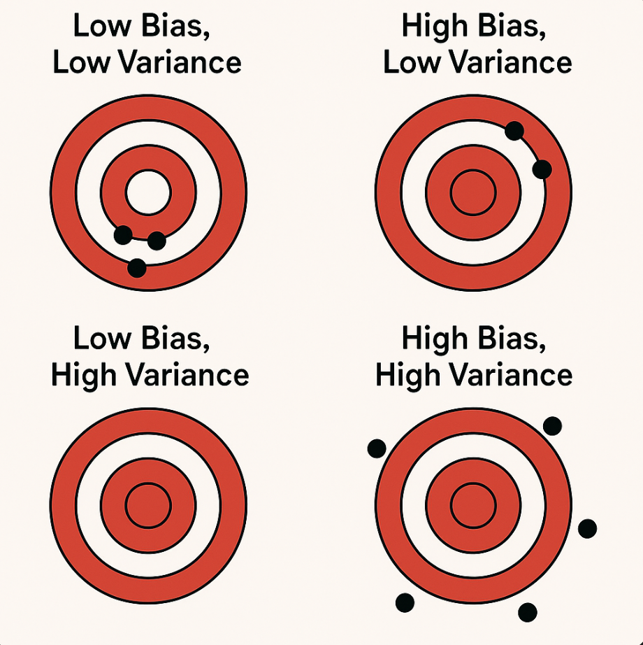

# 편향(bias), 분산(variance)와 둘의 trade-off

 

## 편향(bias)과 분산(variance)이란?

 

| 용어 | 정의 | 비유 | 문제 발생 상황 |
| --- | --- | --- | --- |
| **편향(Bias)** | 모델이 너무 단순해서 패턴을 제대로 학습하지 못하는 정도 | 직선으로 원을 그리려는 아이 | 과소적합(underfitting) |
| **분산(Variance)** | 모델이 너무 복잡해서 학습 데이터가 너무 민감하게 반응하는 정도 | 모든 점에 맞춰 곡선을 꺾는 아이 | 과적합(overfitting) |

 

- 비유 : target은 우리가 맞히고 싶은 정답(ground truth)이고, 우리는 모델이라는 활로 화살을 쏜다.

    - **Bias가 큰 경우** : 화살들이 한쪽 구석에 뭉쳐있음. 애초에 조준이 틀렸음. 모델이 너무 단순해서 정답을 학습하지 못한 것.

    - **Variance가 큰 경우** : 화살들이 표적 주변에 널리 퍼져 있음. 학습 데이터에느 잘 맞지만, 새로운 데이터에 약한 것.

 

## Bias-Variance Trade-off (편향-분산 균형)
- 낮은 편향 + 낮은 분산이 이상적이지만, 실제로는 어렵다.
- 모델이 너무 단순하면 Bias가 높고 너무 복잡하면 Variance가 높다.
- 둘이 **서로 반비례**하는 경향이 있어 모델을 잘 만드려면 적절한 복잡도를 찾는게 중요.
- 모델을 조정해 **총 오차(편향^2 + 분산 + irreducible error)를 최소화**하자.

> 핵심은 "적당한 모델 복잡도"를 선택해 둘 사이의 균형을 맞추는 것

 

- ### `모델이 너무 단순`해? 
    - bias가 높으니 
    - 더 **복잡하게** 만들거나
    - **특성(feature)을 추가**하거나
    - 앙상블의 **부스팅(Boosting)**을 쓰거나
    - **더 오래 학습**

- ### `모델이 너무 민감`해? 
    - variance가 높으니 
    - **일반화**(Regularization - L1, L2)를 하거나
    - **데이터 양을 늘리거나**
    - 앙상블의 **배깅(Bagging)**을 쓰거나
    - **Dropout**(일부 뉴런 끄기)을 사용

- 하이퍼 파라미터를 수정하는 방법도 있음