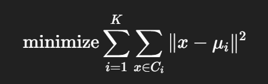

# 목차

- ### K-NN
- ### Decision Tree
- ### SVM
- ### K-Means

<br>

# K-최근접 이웃 (K-Nearest Neighbors, K-NN)

<br>

## 핵심 개념

- 비슷한 데이터끼리는 비슷한 정답을 가질 것이다.
- 즉, 새로운 데이터가 주워졌을 때, 주변에 있는 데이터(k개)의 `레이블`을 보고 다수결로 결정

    - #### 레이블
        - 데이터에 딸려있는 정답 정보

        | 입력 데이터 (Input, X) | 레이블 (Label, 정답, Y)
        | --- | --- |
        | 어떤 사진 이미지 | 강아지 |
        | 어떤 사람의 키/몸무게 | 남자 or 여자 |
        | 시험 성적 80점 | 합격 or 불합격 |
        | 리뷰 내용 "정말 맛있어요!" | "긍정" |

<br>

## 작동 원리

- **가장 가까운 k개의 이웃을 보고, 그 중에서 가장 많은 레이블을 선택**

### 과정 정리

1. #### 학습(training)
    - 특정한 학습 없이,
    - 그냥 데이터를 저장
    - **lazy learning** 또는 instance-based learning 이라 부름

2. #### 예측(predicting):
    - 새로운 데이터 포인트 Xnew 가 들어옴
    - 기존 훈련 데이터들과의 거리(distance)를 계산
    - 가장 가짜운 k개의 데이터를 선택
    - 그 중 가장 많은 레이블을 가진 값으로 예측 결정

<br>

## 거리 계산 방식

| 거리 계산 방법 | 수식 | 설명 |
| --- | --- | --- |
| 유클리디안 거리(Euclidean, L2 Distance) | ((x1 - x2)^2 + (y1 - y2)^2)^(1/2) | 가장 기본적인 거리 계산
| 맨해튼 거리(Manhattan, L1 Distance) | \|x1 - x2\| + \|y1 - y2\| | 격자처럼 직각 방향으로만 움직인 거리 |
| 민코우스키 거리(Minkowski) | (∑ \|xᵢ - yᵢ\|^p)^(1/p) | p값에 따라 다른 거리로 일반화 (p=1이면 맨해튼, p=2이면 유클리디안) |

## 비유로 이해하기

> 시험을 처음 보는 학생이 친구에게 물어보는 상황

- 새로운 학생이 문제를 못품
- 근처에 있는 k명의 친구들에게 "너희는 답 뭐로 선택했어?" 라고 묻고,
- 가장 많은 친구가 말한 답을 따라서 정답으로 쓰는 것

<br>

## 예시

```python
from sklearn.neighbors import KNeighborsClassifier

# 데이터: (공부시간, 수면시간), 
# 레이블은 '합격/불합격'
X = [[8, 6], [7, 5], [3, 7], [2, 8], [1, 2]]
y = ['합격', '합격', '불합격', '불합격', '불합격']

# k=3인 모델 생성
model = KNeighborsClassifier(n_neighbors=3)
model.fit(X, y)

# 새로운 학생: 공부 4시간, 수면 6시간
print(model.predict([[4, 6]]))  # 출력: ['불합격']
```

<br>

## K-NN의 한계
| 문제 | 설명 |
| --- | --- |
| 계산량 많음 | 매번 거리 계산이 필요, 따라서 **데이터가 많을수록 느려짐** |
| 이상치 영향 | **주변에 이상한 데이터**가 있으면 예측이 틀릴 수 있음 | 
| 차원의 저주 | **고차원일수록 거리 계산이 애매**해짐 |

<br>

## 관련 개념

| 용어 | 설명 |
| --- | --- |
| k 값 | 너무 작으면 이상치에 민감, 너무 크면 경계가 흐려짐 |
| 거리 | 유클리리디안 외에도 다양한 거리 척도 사용 가능 | 
| 정규화 | Feature 간 단위가 다를 경우, 스케일링 필수 (예: `MinMaxScaler`) |

- ### MinMaxScaler
    - 정규화 : 머신러닝에서 입력 데이터의 값들이 서로 너무 다른 크기를 가진 경우, 거리 기반 알고리즘에서 한 쪽 Feature가 영향력을 독차지함
    - 그래서 각 특성(feature)의 값을 비슷한 범위로 바꿔주는 작업이 필요

    - 수식 : Xnorm = (x - xmin) / (xmax - xmin)
    - 각 데이터를 0과 1 사이의 값으로 스케일링
    - 예시 코드:
    ```python
    from sklearn.preprocessing import MinMaxScaler
    import numpy as np

    # 예시 데이터 (2개 feature, 3개 샘플)
    X = np.array([[1, 200],
                [2, 300],
                [3, 400]])

    scaler = MinMaxScaler()
    X_scaled = scaler.fit_transform(X)

    print(X_scaled)
    # 출력 결과:
    # [[0.  0. ]
    #  [0.5 0.5]
    #  [1.  1. ]]
    ```

<br>

# 결정 트리 (Decision Tree)

<br>

## 핵심 개념

- 데이터를 조건에 따라 가지를 나누는 트리 구조를 사용하여 예측
- 질문을 통해 데이터를 나누면서 분류하거나 회귀
- #### 비유 : 스무고개 게임
    - "동물인가요?" -> "네 발인가요?" -> ...

<br>

## 작동 원리

- 특정 기준(feature, 임계값)에 따라 데이터를 나눔
- 각 분기점(node)가 질문
- 각 가지(branch)는 질문에 대한 대답(Yes/No)
- 최종 리프 노드는 예측값(분류 or 숫자)

### 과정 정리

1. 모든 데이터를 가져와서
2. 가장 데이터를 잘 나눌 수 있는 질문을 고름
    -> 이때 `불순도(impurity)`를 기준으로 판단 (예: Gini, Entropy)
    
    - #### 불순도(impurity)

        - 그 질문이 얼마나 좋은 질문인지 판단하는 기준
        - 이 질문이 데이터를 얼마나 한쪽으로 깔끔하게 나누는가를 수치로 나타낸 것
        - 예를 들어, 나이가 35세 이하인가요? -> Yes그룹(10세(애니), 12세(애니), 35세(드라마)/No(40세(드라마)) => **Yes그룹에 애니와 드라마가 섞여있으니 불순도가 높음**

        | 불순도 측정 | 수식 | 특징 |
        | --- | --- | --- |
        | 지니 지수(Gini Index) | 1 - ∑pi^2 (pi=클래스비율(예: 애니 = 2/3)) | 빠르고 효율적, 많이 사용 |
        | 엔트로피(Entropy) | - ∑pilog2pi | 정보이론 기반, 정보 이득 계산 |

3. 데이터를 둘로 나눔
4. 나눠진 두 그룹에 대해 다시 같은 작업 반복
5. 멈추는 조건 도달 시 예측값을 출력

<br>

## 예시

```python
from sklearn.tree import DecisionTreeClassifier

# 데이터: [나이, 통화시간], 레이블은 '구매 여부'
X = [[25, 5], [30, 10], [45, 1], [35, 2]]
y = ['구매', '구매', '비구매', '비구매']

model = DecisionTreeClassifier(criterion='gini')
model.fit(X, y)

print(model.predict([[40, 3]]))  # 예측 결과
```

<br>

## 장단점

| 항목 | 장점 | 단점 |
| --- | --- | --- |
| 해석 용이 | 트리 구조가 사람이 이해하기 쉬움 | 과적합(overfiting)되기 쉬움(데이터를 매우 구체적으로 나누려하기 때문에) |
| 데이터 전처리 | 정규화 필요 없음, 스케일 영향이 적음(특성 값이 크든 작든 상관없이 잘 작동) | 작은 변화에도 트리 구조가 확 바뀜(분기점을 기준으로 왼쪽그룹이 될 수도, 오른쪽그룹이 될 수도) |
| 속도 | 학습/예측 빠름 | 깊은 트리는 느려지고 복잡해질 수 있음

<br>

## 관련 개념

| 용어 | 설명 |
| --- | --- |
| 가지치기(Pruning) | 너무 깊은 트리를 잘라서 과적합 방지 |
| 앙상블(Ensemble) | 여러 트리를 모아 성능을 향상(예: Random Forest) |
| 불순도(Impurity) | 노드가 얼마나 섞여 있는지를 나타내는 지표(Gini, Entropy 등) |

<br>

# SVM (Support Vector Machine)

<br>

## 핵심 개념

- 데이터를 분류하기 위해 가장 margin이 넓은 경계선을 찾는 알고리즘
- 단순한 분류기이지만, 비선형 문제도 `커널 기법`으로 해결 가능

    - ### 커널 트릭 (Kernel Trick)
        
        - 데이터를 선형 분리 불가능한 경우
        - 고차원 공간으로 매핑해서 선형 분리를 가능하게 함
        - 데이터가 평면(2D)에 있을 때는 선형으로 나누기 어려울 수 있는데, 커널을 3차원으로 만드는 것. 
        - 비유 : 칠판의 고무자석. 고무판을 우그러뜨리면 처음에 뒤섞여있던 빨간색/파란색 자석들이 서로 위아래로 떨어져 직선 하나로 나눌 수 있게 되는 상황과 비슷
        <br>

        | 커널 종류 | 설명 |
        | --- | --- |
        | 선형 커널 | 일반적인 직선 기준 |
        | RBF(가우시안) 커널 | 데이터가 동그랗게 뭉친 경우 좋음 |
        | 다항식 커널 | 비선형 경계가 필요한 경우 |

        <br>
        - 예시 코드:

        ```python
        from sklearn.svm import SVC

        # 데이터: (점수, 수면시간), 레이블은 '합격/불합격'
        X = [[70, 6], [80, 7], [90, 6], [40, 8], [50, 7]]
        y = ['합격', '합격', '합격', '불합격', '불합격']

        # 모델: 커널은 선형(linear)
        model = SVC(kernel='linear')
        model.fit(X, y)

        print(model.predict([[65, 6]]))  # 출력: ['합격'] or ['불합격']
        ```

- 비유 : 학생들을 줄세우는데, 각 반의 가장 키 큰 학생들 사이에 선을 긋는 방식. 즉, **두 집단의 사이 간격을 최대한 넓히는 선(결정 경계)를 그린다!**

<br>

## 작동 원리

1. 데이터를 분류하기 위해 결정 경계(Hyperplane)를 찾음
2. 가장 가까운 데이터(Support Vectors)와의 거리(Margin)를 최대화
3. 선형 분리가 어려울 경우, 커널 함수를 사용해 고차원 공간으로 변환

### 과정 정리

1. 초평면 정의
    - 2차원 : 선
    - 3차원 : 평면
    - n차원 : 초평면

2. 서포트 벡터 찾기
    - 경계와 가장 가까운 점들(모델 결정에 핵심 역할)

3. 마진 최대화
    - 두 클래스 사이의 가장 큰 여유 공간 확보

<br>

## 수학적 표현

- 결정 경계는 다음과 같은 선형 함수로 표현
    - f(x) = w^Tx + b = 0
    
    - w : 가중치 벡터 (선의 기울기)
    - b : 절편(bias)
    - | w^Tx + b |가 클수록 분류의 확신도가 높음

    - 최적화 문제로 바뀜. margin을 최대화하면서 제약조건을 만족하는 w, b를 찾는 문제.
        - 마진을 최대화 = |w|를 최소화

<br>

## SVM의 장단점

| 장점 | 단점 |
| --- | --- |
| 고차원 데이터에서도 효과적 | 느림(특히 데이터 양 많을 때) |
| 마진 기반으로 일반화 성능 좋음 | 파라미터 튜닝 필요 (C, 커널 등) |
| 다양한 커널로 비선형 문제 해결 가능 | 해석이 어려움(트리처럼 시각화 힘듦) |

<br>

## 관련 개념

| 용어 | 설명 |
| --- | --- |
| 마진(Margin) | 결정 경계와 가장 가까운 데이터 사이의 거리 |
| 서포트 벡터 | 마진에 닿아 있는 데이터 포인트 |
| 커널 함수 | 고차원 공간으로 데이터를 옮기는 방법 |
| C값 | 오차 허용 정도(오차에 얼마나 민감할지) -> 작으면 마진 중시, 크면 오차 최소화 중시 |

<br>

# K-Means Clustering (K-평균 군집화)

<br>

## 핵심 개념

- 레이블이 없는 테이터를 유사한 특징끼리 묶는 비지도 학습 알고리즘
- K개의 중심점(centroid)를 기준으로 데이터를 나누고, 반복적으로 군집(cluster)을 개선
- 비유 : 학생들의 키와 체중을 기준으로 기준점을 만들고, 비슷한 친구들끼리 묶기

<br>

## 작동 원리 (반복 최적화 과정)

1. 원하는 군집 개수 K를 정함
2. 랜덤하게 K개의 중심점(centroid)을 초기화
3. 각 데이터를 가장 가까운 중심점에 할당
4. 각 군집의 중심점을 데이터 평균으로 업데이트
5. 중심점이 더 이상 변하지 않을 때까지 3~4번 반복

<br>

## 수학적 표현

- 목적 : 각 데이터와 중심점 간의 거리의 제곱합을 최소화



- Ci : i 번째 군집
- 𝜇i : i 번째 군집의 중심점
- ||x - 𝜇i||^2 : 거리의 제곱 (보통 유클리디안 거리 사용)

<br>

## 예시 코드

```python
from sklearn.cluster import KMeans
import numpy as np

# 예시 데이터 (공부시간, 수면시간)
X = np.array([[1, 2], [1, 4], [1, 0],
              [4, 2], [4, 4], [4, 0]])

# K=2로 군집화
model = KMeans(n_clusters=2, random_state=42)
model.fit(X)

print("라벨:", model.labels_)
print("중심점:", model.cluster_centers_)
```

<br>

## K-Mean의 장단점

| 장점 | 단점 |
| --- | --- |
| 구현이 간단, 계산 속도가 빠르고 효율적 | K값(클러스터 수)를 미리 알아야 함 -> 도메인 지식이 없으면 최적 K 결정 어려움 |
| 대규모 데이터일수록 계산 기반의 성능이 좋아짐 | 초기 중심값에 민감해 초기값에 따라 결과가 달라질 수 있음(`로컬 최적해` 가능성) |
| 시각화 및 해석이 쉬움 | 비구형(비선형) 데이터에 한계 -> 둥근 형태가 아닌 클러스터는 잘 구분 못함 |
| 중심을 반복 갱신하는 방식으로 비교적 빨리 수렴함 | 스케일(크기)에 민감 -> 거리 기반으로 정규화가 필수 |
| 간단한 계산으로 메모리 자원 소모 적음 | 이상치에 취약 -> 평균 기반이므로 극단값에 영향을 많이 받음 |
| 거리 기반 | 유클리드 거리 기반으로 직관적 | 군집 간 밀도 차이 고려 불가 -> 밀도나 분포가 다르면 부정확한 군집화 가능 |

### 로컬 최적해(local optimum)

- 전체 중에 최고는 아니지만 주변에서는 최고인 답을 찾게 될 때

<br>

## 관련 개념

| 개념 | 설명 |
| --- | --- |
| 중심점 | 각 군집의 중심(평균값) |
| 군집 수 K | 사전에 정해야 하며, 잘못 설정하면 성능 저하 |
| 정규화 | 변수 간 단위가 다를 경우 필요 |
| `엘보우 기법` | 적절한 K값을 찾기 위한 시각적 방법 |
| `실루엣 계수` | 군집의 품질을 평가하는 지표 (0~1 사이) |

#### 엘보우 기법(Elbow Method)

- 적절한 K값(군집 수)를 고르기 위한 시각적 도구
- K가 커질수록 당연히 군집 내부의 오차(SSE, WCSS)가 줄어듦
- 하지만 어느 순간부터는 덜 줄어들고, 굳이 늘릴 필요 없는 시점이 나옴.
- 팔꿈치 꺾이는 지점처럼 생김 => 적절한 K값인 지점

#### 실루엣 계수

- 군집을 얼마나 잘 만들었는지 정량적으로 평가하는 방법
- 값은 0~1 사이이고, 1에 가까울수록 좋은 군집화
- 계산 방법 : silhouette = (b - a)/max(a, b)
    - a : 자기 클러스트 안에서 평균 거리(같은 군집에서 얼마나 떨어져 있는가)
    - b : 다른 클러스터들과의 거리 중 가장 작은 값(다른 군집과 얼마나 떨어져 있는가)
- 나랑 같은 그룹끼리는 가까워야하고,
- 나랑 다른 그룹은 멀어야 함.
