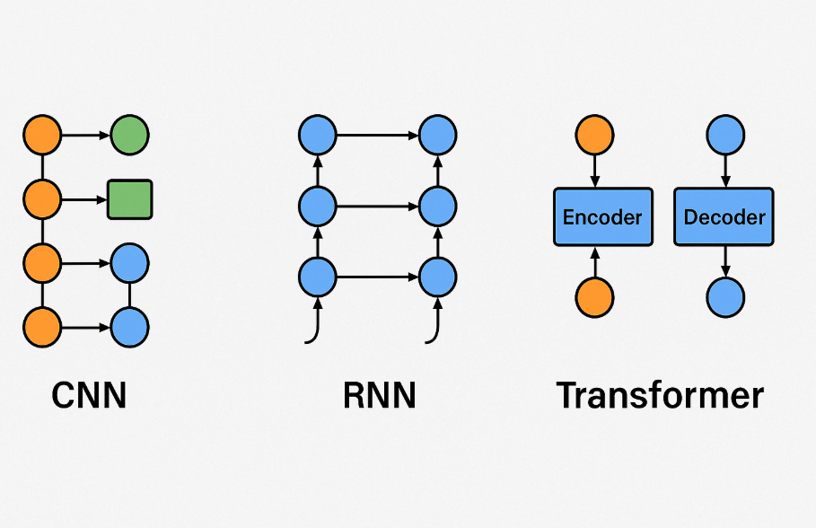
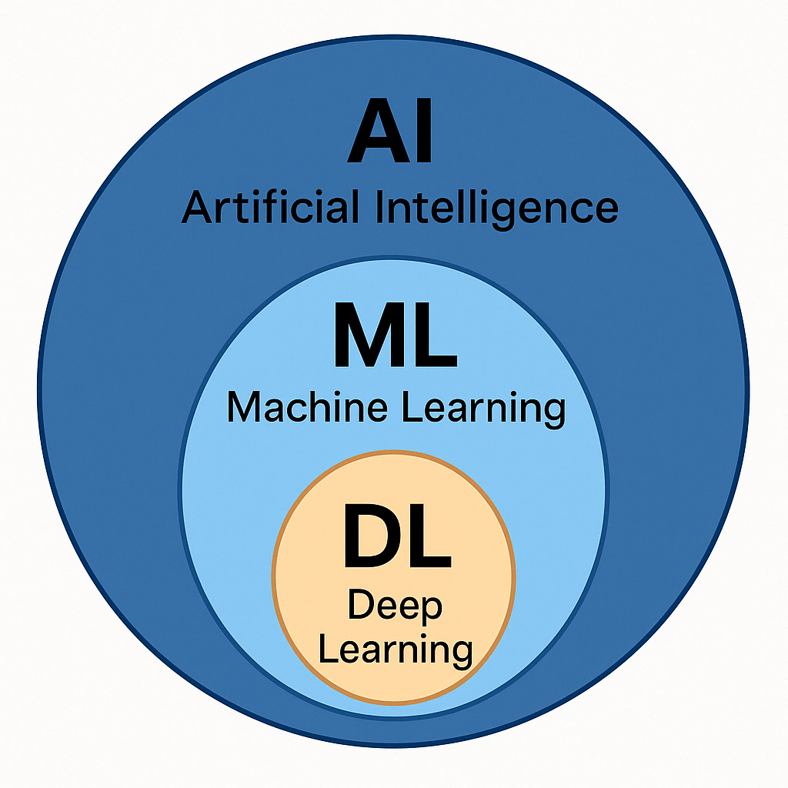

# AI, ML, DL

 

## 1. 인공지능 (Artificial Intelligence, AI)
- 정의: 인간의 지능(생각, 학습, 문제 해결, 의사 결정 등)을 기계가 **모방하도록** 만드는 기술

- 비유: 로봇이 사람처럼 행동하려고 연기하는 것

- 예시:
    - 체스를 두는 AI (ex. 알파제로)
    - 음성 인식 (Siri, Google Assistant)
    - 스마트 냉장고가 음식 주문하기

- 목표 : **인간처럼 판단하고 행동**하는 능력 전반

 

## 2. 기계학습 (Machine Learning, ML)
- 정의: AI의 한 분야로, 경험(데이터)을 통해 **스스로** 학습하고 성능을 개선하는 알고리즘

- 비유: 사람이 공부해서 점점 똑똑해지는 것과 유사

- 예시:
    - 스팸 메일 필터: 스팸/비스팸 예시를 많이 보여주면, 이메일을 분류할 수 있게 됨
    - 영화 추천 시스템: 네가 어떤 영화 좋아했는지 학습해서 추천

- 목표 : 규칙을 ~~프로그래머가~~ 직접 코딩하는 게 아니라, **데이터에서 규칙**을 찾는 구조

### 머신러닝 종류 분류

| 종류 | 설명 | 예시 |
|------|------|------|
| **지도학습 (Supervised Learning)** | 입력과 정답(label)이 주어짐 | 이메일 스팸 분류, 집값 예측 |
| **비지도학습 (Unsupervised Learning)** | 정답 없이 패턴만 찾음 | 고객 군집화, 추천 시스템 |
| **강화학습 (Reinforcement Learning)** | 보상을 기반으로 학습 | 알파고, 로봇 제어 |

 

## 3. 딥러닝 (Deep Learning, DL)
- 정의 : ML의 한 종류로, **인공신경망(Neural Network)을 깊게 쌓은** 모델을 사용함

- 비유 : 뇌 구조를 흉내 낸 모델로, 스스로 복잡한 패턴을 학습

- 예시:
    - 얼굴 인식 (딥페이크, 인스타 필터)
    - 자율주행차 비전
    - ChatGPT, 번역기, 이미지 생성 AI

- 목표 : 복잡한 문제(예: 이미지/음성/언어) 해결
* **Big Data + 고성능 GPU** 덕분에 딥러닝이 폭발적으로 발전함!

### 딥러닝 주요 모델 구조 비교

| 구조 | 설명 | 대표 적용 분야 |
|------|------|----------------|
| **CNN (합성곱 신경망)** | 이미지 특징 추출에 강함 | 이미지 분류, 의료 영상 |
| **RNN (순환 신경망)** | 순차 데이터 처리에 강함 | 음성 인식, 번역기 |
| **Transformer** | 병렬 처리 + 문맥 이해 | GPT, BERT, 번역, 요약 |

### AI / ML / DL 요약 비교표
- AI ⊃ ML ⊃ DL

| 항목 | AI | ML | DL |
|------------|-----------------------------|--------------------------------|--------------------------------------|
| 포함 관계  | 가장 넓은 개념 | AI의 하위 집합 | ML의 하위 집합 |
| 주요 목표  | 인간처럼 행동 | 데이터로 학습 | 신경망으로 복잡한 패턴 학습 |
| 주된 방식 | 규칙 기반 + 학습 기반 | 지도/비지도/강화학습 | CNN, RNN, Transformer 등 |
| 예시 | 알파고, 자율주행 | 추천 시스템, 예측 모델 | 얼굴 인식, GPT, DALL-E |

### 요약
- `AI`는 전체 "지능 시스템"
- `ML`은 "공부해서 학습하는 방법"
- `DL`은 "뇌처럼 복잡한 네트워크로 고급 학습하는 방법"

 

#### DL이 ML보다 각광받게 된 흐름
- 기존 ML은 Feature Engineering에 **사람의 개입이 많고**, 복잡한 문제엔 **한계**
- DL은 End-to-End 학습이 가능 → 사람이 손대지 않아도 **복잡한 추상적 패턴을 자동 학습**
- 특히 **비정형 데이터** (텍스트, 이미지, 음성)에서 압도적인 성능
- GPU, 데이터량의 폭발적인 증가가 DL을 밀어줌

#### DL이 ML보다 더 효과적인 이유

1. **자동 특징 추출**(Feature Engineering)
    - 머신러닝에서는 데이터의 feature를 사람이 직접 선정, 추출

    EX) 이미지에서 고양이를 분류할 때 '귀의 모양', '수염의 길이' 등 구체적인 특징을 엔지니어가 설계

    - 딥러닝은 인공신경망의 여러 층을 통해 데이터의 중요 feature를 스스로 학습. 즉, 별도의 특징 추출 과정 없이 원본 데이터만 입력하면 의미있는 정보 자동 추출.

2. **복잡하고 비정형적인 데이터 처리 능력**
    - 딥러닝은 이미지, 음성, 자연어 등 대용량의 비구조화 데이터에서 뛰어난 성능. 심층 신경망이 복잡하 ㄴ패턴 인식과 추상화에 강점이 있어, ML로 어려운 문제도 효과적으로 해결.

3. **높은 예측 정확도**
    - 충분한 데이터와 연산 자원이 주어지면, DL 정확도가 ML 정확도보다 훨씬 더 높음. 

    EX) 이미지 인식, 음성 인식, 번역 등 다양한 분야에서 기존 ML보다 월등한 성능

4. **대규모 데이터 활용 능력**
    - ML은 데이터가 적을 때 유리한 반면, DL은 데이터가 많을수록 성능 향상