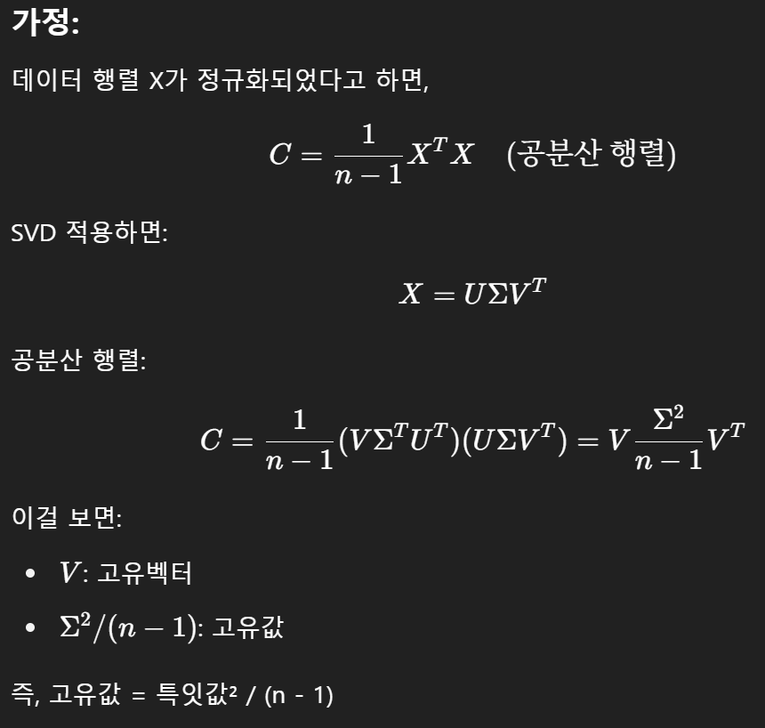

# PCA와 고유값, SVD의 관계

<br>

## PCA(주성분 분석)이란?
- 고차원 데이터 → 저차원 데이터로 줄이되(압축), 정보(분산)를 최대한 보존하는 방법
- 데이터를 **분산이 가장 큰 방향**으로 재정렬하여 중요 정보를 유지한 채 차원을 축소함
- 핵심 개념: **선형 투영(linear projection)**

<br>

## 고유값/고유벡터와 PCA

- `PCA의 구현` : 공분산 행렬의 고유값 분해. 
    즉, 공분산 행렬을 만들고 그 행렬의 고유값/고유벡터를 구함.
    - X ∈ R^(nxd) : n개의 샘플, d차원의 변수
    ```python
    X = [[2, 0],
        [0, 1],
        [3, 1]]  # 3X2행렬 : 데이터 3개, 변수 2개
    ```
    - STEP1 : 데이터 정규화 (평균 0으로 맞춤)
    ```python
    X_mean = np.mean(X, axis=0)
    X_centered = X - X_mean  # Xc = X - μ
    ```

    - STEP2 : 공분산 행렬 C = 1/(n - 1) * X^TX 계산
    ```python
    cov_matrix = (X_centered.T @ X_centered) / (X_centered.shape[0] - 1)
    ```

    - STEP3 : 고유값 분해 C = QΛQ^T (Q : 고유벡터, Λ : 고유값)
    ```python
    eigvals, eigvecs = np.linalg.eig(cov_matrix)
    ```

    - STEP4 : 고유값이 큰 순서대로 고유벡터 선택(주성분)
        - 상위 k개의 고유벡터 선택(Wk)
        - PCA 결과 : `X_pca = X_centered @ W_k`

### 왜 고유값/고유벡터?
- 고유벡터 : 선형 변환 후에도 방향이 바뀌지 않는 벡터,  데이터의 주요 방향(축)을 알려줌
- 고유값 : 해당 방향의 중요도(분산)를 나타냄

- **고유값이 클수록? 해당 방향으로 데이터가 펼쳐져있음**

<br>

## SVD(Singular Value Decomposition)이란?
- 모든 형태의 실수 행렬 A∈R^(mxn)에 대해 가능한 분해 방식
- `A = UΣV^T`
    - U : 좌측 직교행렬 (열: 왼쪽 특이벡터)
    - Σ : 대각 행렬 (특잇값 σi, singular values, 크기순 정렬)
    - V^T : 우측 직교행렬 (행: 오른쪽 특이벡터)
    - A의 rank : 0이 아닌 특잇값의 개수
    - A^TA의 고유값 = σi^2

### PCA와 SVD의 관계

- 고유값 분해는 대칭 정방행렬(공분산 행렬 등)에만 적용 가능하며, 실수 고유값과 직교하는 고유벡터를 가짐.
- 반면, SVD는 모든 m×n 행렬에 대해 가능하며, 직교 벡터들로 분해되어 수치적으로 안정적

- **PCA는 SVD를 통해 더 빠르게 계산**할 수 있음
    - PCA는 원래 공분산 행렬을 만든 뒤에 고유값 분해로 주성분을 찾음
    - SVD는 **공분산 행렬을 만들지 않고도** 주성분 찾기 가능
    - 모든 데이터 행렬에 적용 가능해 계산이 더 안정적이고 빠름

- 데이터 행렬 X (정규화된 형태)에서:
    - **V : V의 열벡터 = PCA이 주성분**
    - **Σ^2/(n - 1): 특잇값^2/(n-1) = 공분산 행렬의 고유값**

    

    - 예시로 검증

    ```python
    import numpy as np

    X = np.array([2, 0],
                [0, 1],
                [3, 1])
    
    X_centered = X - X.mean(axis=0)

    C = (X_centered.T @ X_centered) / (X.shape[0] - 1)
    eigvals, eigvecs = np.linalg.eig(C)

    # SVD
    U, S, VT = np.linalg.svd(X_centered, full_matrices=False)

    # 고유값 vs 특잇값^2 / (n - 1)
    print("고유값 : ", eigvals)
    print("특잇값^2 / (n - 1) : ", (S**2) / (X.shape[0] - 1))  # 일치함
    ```

### PCA와 SVD의 비교

| 개념 | PCA | SVD |
|------------|----------------------------|---------------------------------|
| 계산방식 | 공분산 행렬의 고유값 분해 | 데이터 행렬 직접 분해해 |
| 목적 | 차원 축소 | 일반 행렬 분해 |
| 적용 행렬 | 정방행렬 | 직사각행렬 포함 |
| 입력 | 공분산 행렬 | 원 데이터 행렬 |
| 출력 | 고유벡터, 고유값 | U, Σ, V^T |
| 연산 성능 | 느릴 수 있음 (고유값 분해) | 더 빠름 (특잇값 분해) |
| 적용 | 통계, 머신러닝| 영상, 신호, 추천 시스템 |

### 응용 사례

| 분야 | 활용 사례 |
|--------------|----------------------------------------------------------------------------|
| 이미지 압축 | 고해상도 이미지를 SVD로 분해 후 상위 몇 개 특잇값만 사용해 저장. 예를 들어, 90%의 특잇값을 제거해도 이미지 품질 유지 가능 |
| 얼굴 인식 | PCA(=Eigenfaces)를 통해 얼굴 특징 추출 |
| 생명과학 | 유전자 데이터 차원 축소 후 군집 분석 |
| 추천 시스템 | 사용자-상품 행렬을 SVD로 분해해 잠재 요인(latent factor) 추정. 예를 들어, Netflix Prize 대회에서 이 방법이 효과적으로 사용됨 |
| 자연어 처리 | 단어-문서 행렬에 적용해 잠재 의미 분석(LSA)을 수행. 단어 간의 숨은 의미 관계 파악. |
| 신호 처리 | 노이즈 제거, 음성 특성 압축 등 |
| 로봇 제어 | 역운동학 문제에서 야코비안 행렬의 의사역행렬을 계산할 때 |

### SVD를 활용한 이미지 압축 코드 예시

```python
import numpy as np
import matplotlib.pyplot as plt
from PIL import Image

# 흑백 이미지 불러오기
img = Image.open('lenna.png').convert('L')
A = np.array(img)

# SVD 분해
U, S, VT = np.linalg.svd(A, full_matrices=False)

# k개 특잇값만 사용
k = 10
A_k = U[:, :k] @ np.diag(S[:k]) @ VT[:k, :]

# 시각화
plt.subplot(1, 2, 1)
plt.imshow(A, cmap='gray')
plt.title("원본 이미지")

plt.subplot(1, 2, 2)
plt.imshow(A_k, cmap='gray')
plt.title(f"{k}개 특잇값으로 압축")

plt.show()
```

### 구현 비교 (SVD 안쓸 때, 쓸 때)

```python
# PCA 구현 (고유값 분해 기반)
import numpy as np
import matplotlib.pyplot as plt

# 1. 예제 데이터 생성 (2차원)
np.random.seed(42)
X = np.random.rand(100, 2)
X = X @ np.array([[3, 1], [1, 2]])  # 방향성이 있는 분포로 변형

# 2. 평균 0으로 정규화
X_mean = np.mean(X, axis=0)
X_centered = X - X_mean

# 3. 공분산 행렬 계산
cov_matrix = np.cov(X_centered.T)

# 4. 고유값 분해
eigvals, eigvecs = np.linalg.eig(cov_matrix)

# 5. 고유값 큰 순서로 정렬
idx = np.argsort(eigvals)[::-1]
eigvecs = eigvecs[:, idx]

# 6. 주성분 선택 (여기서는 2개)
principal_components = eigvecs[:, :2]

# 7. 차원 축소 (PCA 변환)
X_pca = X_centered @ principal_components

# 시각화
plt.scatter(X_pca[:, 0], X_pca[:, 1], alpha=0.7)
plt.title("PCA 변환 결과")
plt.xlabel("PC1")
plt.ylabel("PC2")
plt.axis("equal")
plt.show()
```

```python
# SVD 기반 PCA 구현(더 빠른 방법)
# 1. 정규화된 데이터 사용
X_centered = X - np.mean(X, axis=0)

# 2. SVD 분해
U, S, VT = np.linalg.svd(X_centered, full_matrices=False)

# 3. 주성분 (right singular vectors)
principal_components_svd = VT[:2].T  # V^T에서 상위 2개 열

# 4. 차원 축소
X_pca_svd = X_centered @ principal_components_svd

# 시각화
plt.scatter(X_pca_svd[:, 0], X_pca_svd[:, 1], alpha=0.7, color='orange')
plt.title("SVD 기반 PCA 결과")
plt.xlabel("PC1")
plt.ylabel("PC2")
plt.axis("equal")
plt.show()
```

```python
# 고유값과 특이값 비교 (PCA와 SVD의 수학적 연결 확인)
print("고유값 (Covariance Matrix):", eigvals)
print("특잇값 (SVD):", S)
print("고유값 정렬 (큰 순):", sorted(eigvals, reverse=True))
print("특잇값 제곱 / n (≈ 고유값):", (S ** 2) / (X.shape[0] - 1))  # 거의 일치함
```

<br>

## 주요 용어 정리

| 용어 | 의미 |
|---------------|----------------------------------------------------------------------|
| 고유값 (λ) | 공분산 행렬이 특정 벡터를 얼마나 늘이거나 줄이는지 나타내는 값 |
| 고유벡터 | 선형 변환 후에도 방향이 바뀌지 않는 벡터 |
| 특잇값 (σ) | 행렬이 늘이거나 줄이는 정도를 나타냄 (√고유값 관계) |
| 공분산 행렬 | 변수 간의 분산 및 공분산을 나타낸 정방행렬 |
| 주성분 | 데이터의 분산이 가장 큰 방향의 벡터 (고유값 기준 정렬된 고유벡터) |
| PCA | 주성분 방향으로 데이터를 투영해 차원을 줄이는 방법 |
| SVD | 모든 행렬을 정교하게 분해하는 방법 (직교 벡터 + 스케일 분해) |