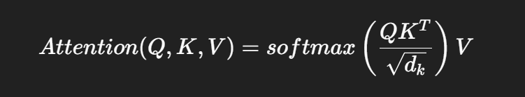

# 1. `Attention`이란?

- 입력 정보들 중 어떤 부분에 더 집중할지 결정하는 메커니즘

- 문장을 번역할 때, 입력 문장의 중요한 단어에 가중치를 주어 보는 것

- 특히 Transformer 모델에서 중심이 되는 아이디어

<br>

# 2. 왜 필요한가?

- 기존의 RNN, LSTM은 정보를 순차적으로 처리함

- ### 하지만 두 가지 큰 문제점이 있었음

    - #### 1. 긴 문장은 기억이 흐릿해진다.
        - 처음 단어는 끝날 때쯤 잊어버림
    
    - #### 2. 모든 입력을 똑같이 취급
        - 번역할 때 중요한 단어와 덜 중요한 단어의 구분이 없음
    
- #### 그래서 등장한 것이 Attention 
    - 중요한 입력에 더 많은 '집중력'을 두자.

<br>

# 3. 작동원리 (with 수식)

- 핵심 아이디어 : 각 Query가 모든 Key와 얼마나 잘 맞는지 계산해서 Value들을 조합 

1. 입력 임베딩 -> Q, K, V로 변환 (선형 변환)
2. Q와 K의 유사도(점곱)를 계산 -> 얼마나 관련 있는지
3. Softmax로 정규화 -> attention weight
4. V와 곱해 최종 출력

## 수식



- Q, K, V = Query, Key, Value 행렬
- d_k = key의 차원 수 -> 값이 커질수록 dot product도 커지니 이를 루트로 나눔 (스케일 조정)

<br>

# Self-Attention이란?

- 내 자신에게 집중한다!
- 입력 문장 내의 각 단어가 다른 단어들과 얼마나 연관되어 있는지를 계산하는 방식

- #### 예시 :
    
    - 문장 : "The cat sat on the mat"

        - "cat"이 "sat"이나 "mat"과 얼마나 연관 있는지를 판단해서,
        
        - 더 중요한 단어는 더 높은 가중치

        - 즉, 단어들 간의 관계(context)를 학습하는 방식

<br>

# 5. Multi-Head Attention

- 한 번만 계산하면, 한 가지 관점에서만 집중

    - 그래서 여러 개의 Head를 둬서 서로 다른 관점에서 attention을 계산한 후, 마지막에 결과를 합침

    ```python
    [ Head 1 ] → 😃
    [ Head 2 ] → 🤓
    [ Head 3 ] → 😯
    ... 
    # 다양한 관계를 본다!
    ```

<br>

# 6. PyTorch 코드 예시

```python
import torch
import torch.nn.functional as F

def attention(Q, K, V):
    d_k = Q.size(-1)
    scores = torch.matmul(Q, K.transpose(-2, -1)) / torch.sqrt(torch.tensor(d_k, dtype=torch.float32))
    weights = F.softmax(scores, dim=-1)

    return torch.matmul(weights, V)
```

<br>

# 정리

| 항목 | 설명 |
| --- | --- |
| Attention | 중요한 입력 정보에 집중 |
| Self-Attention | 자기 안에서 연관성 판단 |
| Multi-Head | 다양한 시각에서 판단 |

