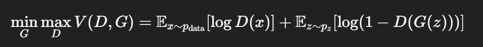

# 1. GAN (Generative Adversarial Network) 이란?

> Generative Adversarial Network, 줄여서 GAN은 이미지를 생성(generate)하는 능력을 갖춘 신경망, (2014년 처음 제안됨)

### 뭐가 그렇게 특별할까?

- 진짜 같은 가짜 이미지를 생성
- 사진, 그림, 음성, 음악, 심지어 패션 디자인 생성
- 이미지 복원, 스타일 변환, 딥페이크 등 널리 사용

<br>

# 2. 왜 GAN을 만들었을까?

### 기존의 생성 모델 한계

- 과거에는 확률 모델이나 Autoencoder를 사용하여 데이터를 생성했으나,
- 이 방법들은 샘플링이 어렵고, 생성물 퀄리티도 낮음

- 그래서 "경쟁시키면 더 똑똑해지지 않을까?" 라는 발상으로 GAN이 탄생

<br>

# 3. GAN의 구조

- GAN은 두 개의 신경망이 서로 경쟁(Adversarial)하는 구조

| 역할 | 이름 | 설명 |
| --- | --- | --- |
| 가짜를 생성 | Generator (G) | 노이즈를 받아 진짜 같은 이미지를 생성 |
| 진짜/가짜 판별 | Discriminator (D) | 입력이 진짜 데이터인지, G가 만든 가짜인지 판단 |

#### 목적
- Generator는 Discriminator을 속이려 하고, Discriminator은 속지 않으려 함

<br>

# 4. GAN 작동 원리

1. Generator는 랜덤한 노이즈(z)를 받아 가짜 데이터 생성
2. Discriminator는 진짜 데이터와 Generator가 만든 데이터를 비교하여 진짜/가짜 구분
3. Generator는 Discriminator를 속이기 위해 더 진짜 같은 데이터를 만듦
4. Discriminator는 더 잘 구분하도록 학습

-> 반복하면서 둘 다 점점 강력해짐

### GAN은 지도학습인가?

| 구분 | 설명 |
| --- | --- |
| Discriminator 학습 | 정답(Label) 존재. 진짜 데이터는 1 가짜 데이터는 0 |
| Generator 학습 | 정답 없음. 목표는 단 하나, D를 속이는 것. 그래서 강화학습에 가까움 |

### 이렇게 생각해보자

- Generator : 위조지폐범
- Discriminator : 경찰

- 위조지폐범은 더 정교하게 돈을 만들고, 경찰은 더 눈을 부릅뜨고 감별
- 시간이 지날수록 거의 진짜같은 위조지폐 등장

<br>

# 5. 수학적 원리

- GAN은 최적화 게임 구조



- D는 진짜는 1, 가짜는 0으로 맞히도록 학습
- G는 D(G(z))가 1에 가까워지도록 학습(속이기)

<br>

# 6. 다양한 GAN의 변형들

| 모델 | 설명 |
| --- | --- |
| DCGAN | ConvNet 기반 GAN (이미지 생성) |
| CGAN | 조건(예: 숫자 3)으로 생성 방향 제어 |
| CycleGAN | 사진으로 그림 변환 (스타일 변환) |
| StyleGAN | 얼굴 생성에 특화, 매우 정교 |
| Pix2Pix | 입력 이미지 -> 출력 이미지 (예: 스케치 -> 색칠) | 
| WGAN | 안정적인 학습을 위한 `Wasserstein 거리` 사용 |

#### Wasserstein 거리

- 두 개의 다른 분포가 있을 때, 한 분포를 다른 분포로 옮기는데 드는 최소 비용

<br>

# 7. 코드 예시 (PyTorch)

- MNIST 숫자 이미지 생성 예시

```python
import torch
import torch.nn as nn

# Generator (가짜 데이터 생성 모델)
class Generator(nn.Module):
    def __init__(self):
        super().__init__()
        self.gen = nn.Sequential(
            nn.Linear(100, 256),  # 입력: 100차원 노이즈 → 은닉층 256차원으로 변환
            nn.ReLU(),  # 활성화 함수: ReLU 사용
            nn.Linear(256, 784),  # 은닉층 256 → 출력층 784 (28x28 이미지 크기)
            nn.Tanh()  # 출력값을 -1 ~ 1 범위로 스케일링 (MNIST와 맞춤)
        )
    def forward(self, z):
        return self.gen(z)  # 노이즈 z를 입력받아 가짜 이미지 출력

# Discriminator (진짜/가짜 판별 모델)
class Discriminator(nn.Module):
    def __init__(self):
        super().__init__()
        self.dis = nn.Sequential(
            nn.Linear(784, 256),  # 입력: 28x28 이미지를 256차원 은닉층으로
            nn.LeakyReLU(0.2),  # LeakyReLU로 죽은 뉴런 방지
            nn.Linear(256, 1),  # 은닉층 256 → 출력층 1 (진짜 or 가짜 확률)
            nn.Sigmoid()  # 0~1 사이 확률값으로 변환
        )
    def forward(self, x):
        return self.dis(x)  # 입력 이미지 x를 받아 진짜/가짜 확률 출력
```

<br>

# 8. 정리 요약

| 항목 | 설명 |
| --- | --- | 
| GAN 목적 | 진짜 같은 데이터 생성 |
| 구성 |  Generator vs Discriminator |
| 학습 방식 | 서로 경쟁하며 발전 (Adversarial) |
| 장점 | 매우 사실적인 데이터 생성 가능 |
| 단점 | 학습 불안정 (Mode collapse, 수렴 어려움) |
| 응용 분야 | 이미지 생성, 딥페이크, 스타일 변환, 슈퍼 해상도 등 |

### 지금(2025년)에도 GAN은 잘 쓰이고 있는가?

| 구분 | 내용 |
| --- | --- |
| GAN 기본형 | 조금 덜 쓰임 (학습 불안정, 최적화 힘듦) 대신 안정화된 변형(`WGAN` 등)은 여전히 연구 |
| StyleGAN 계열 | 아주 강력하게 사용중 -> 특히 얼굴 생성, 아바타 생성, 3D 모델링에 최고 |
| Diffusion 모델 | 요즘의 대세! DALL-E 3, Stable Diffusion 같은 모델은 `Diffusion` 기반, GAN보다 학습 안정성과 품질이 좋아서 엄청나게 인기 |
| 특수 분야 | 여전히 GAN 많이 씀 -> 영상 프레임 생성, 노이즈 제거, 데이터 증강, 이미지 복원 등 특화 사용 |

#### WGAN (Wasserstein GAN)

- 기존 GAN의 문제점
    - Discriminator가 너무 잘하면 Gradient Vanishing(미분이 0돼서 Generator 학습 멈춤)
    - JS Divergence가 발산하면 (진짜/가짜가 겹치지 않으면) 학습이 아예 안 됨

- WGAN의 아이디어
    - 거리 측정 방식을 Wasserstein Distance로 교체
    - 손실 함수(Loss function) 자체를 바꿔 부드럽게, 안정적으로 학습되게 함

#### Diffusion 모델이란? (왜 요즘 대세?)

- Diffusion 기본 아이디어

| 과정 | 설명 |
| --- | --- |
| Forward Process | 점점 노이즈 추가해서 데이터를 망가뜨림 |
| Reverse Process | 노이즈를 거꾸로 제어하면서 원본을 복원 |

- 흐름 정리
    
    1. 원본 이미지를 점점 노이즈로 덮어씌움 (완전 랜덤 노이즈까지)
    2. 그 다음 학습을 통해 노이즈를 제거하는 방법을 배움
    3. 완전 랜덤 노이즈에서 출발해 점차 진짜 같은 이미지를 복원해 내는 것