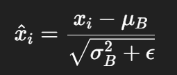

# Batch Normalization 이란?

- 딥러닝 학습할 때 각 층(layer)으로 들어가는 입력을 `정규화`시켜 학습을 더 빠르고 안정적으로 만드는 기법

    - 정규화 : 데이터를 평균 0, 분산 1로 변환하는 작업
    - 배치 : 학습할 때 한 번에 처리하는 데이터 묶음

```css
[Input] → [BatchNorm] → [Activation Function (ReLU 등)] → [Next Layer]
```

BatchNorm은 보통 Linear나 Convolution 연산 후 Activation(ReLU 등) 전에 끼워 넣는 과정

<br>

# 왜 필요한가 ?

- BatchNorm을 발명하게 된 이유에서 시작
- ### 문제점 : Internal Covariate Shift
    - 학습 도중에 각 층의 입력 데이터 분포가 계속 변함
    - 즉, 앞쪽 레이어가 조금만 업데이트되더라도 뒤쪽 레이어로 들어오는 입력의 분포가 흔들림
    - 그러면 뒤쪽 레이어는 계속 적응을 해야하는 상황
- 위의 상황을 internal covariate shift(내부 공변량 변화)라고 부름
- ### 해결책 : 입력 분포를 일정하게 유지
- 학습 중에 입력 분포를 꽉 잡아주면 학습량이 훨씬 빨라지고 안정적
- 여기서 등장하게 된 것이 Batch Normailization

<br>

# Batch Normalization의 작동 방식

1. #### 미니배치 입력 가져오기
- 현재 층의 입력값들 x1, x2, ... , xm (batch size = m)

2. #### 미니배치 평균 계산
- μB = 1/m * ∑xi

3. #### 미니배치 분산 계산
- σ^2B = 1/m * ∑(xi - μB)^2

4. #### 정규화



- 평균 0, 분산 1로 만들기
- 여기서 ϵ는 0으로 나누는걸 막기위한 아주 작은 값

5. #### Affine 변환 

- yi = γhatxi + β
- γ (scale parameter) : 얼마나 키울까
- β (shift parameter) : 얼마나 이동시킬까
- 정규화만 하고 끝이 아니다. 네트워크가 자유롭게 다시 조정할 수 있게 해줌

<br>

# BatchNorm을 쓰면 좋은 점

| 효과 | 설명 |
| --- | --- |
| 학습 빨라짐 | 입력이 깔끔하니 경사 하강이 잘 됨 |
| 안정적 수렴 | gradient vanishing/exploding 갑자기 폭발하거나 발산하는 일 줄어듦 |
| 초기값에 덜 민감 | 가중치 초기화 잘못해도 덜 망함 |
| 규제 효과 | Dropout처럼 과적합을 조금 막음 |

<br>

# 주의할 점

- Batch Size가 너무 작으면 성능이 오히려 나빠짐 (평균과 분산 추정이 부정확해지니까)
- RNN처럼 시퀀셜 모델에는 잘 안맞을 때도 있음 (그래서 RNN에는 대신 LayerNorm(레이어 정규화)이 더 자주 쓰임)
- 학습과 테스트 때 다르게 작동해야함
    - 학습 땐 mini-batch 통계 사용
    - 테스트 땐 학습 중 저장한 running 평균/분산 사용

