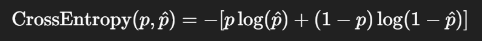
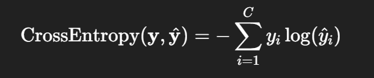

# Cross Entropy Loss란?

- 교차 엔트로피, 두 확률 분포 간의 차이를 측정하는 함수
- 보통은 모델의 **출력 확률 분포**와 **정답 라벨(원핫 벡터)의 분포** 간 차이를 계산

### 엔트로피(entropy)

- 불확실성을 측정
- 예를 들어, 모든 클래스가 25% 확률 -> 매우 불확실 -> **높은 엔트로피**
- 한 클래스만 100% -> 확실 -> 낮은 엔트로피

### 교차 엔트로피(cross entropy)

- 모델이 예측한 확률 분포 <-> 실제 정답 분포 사이의 차이를 측정
- 즉, 모델이 얼마나 잘 맞췄는지 수치화한 손실 함수

 

## 수식

- ### 이진 분류의 경우

    - 
    - p : 실제 정답 (0 또는 1)
    - p_hat : 모델이 예측한 확률 (0 ~ 1 사이)
    - 예를 들어, 실제 정답 1이고 모델 예측이 0.9이면, Loss = - log(0.9) = 0.105 -> 꽤 잘 맞춰 손실값 작음

- ### 다중 클래스의 경우는?

    - 

  - yi : 정답 라벨의 one-hot vector (예: [0, 1, 0])
  - yi_hat : softmax를 거친 예측 값

 

## 왜 Cross Entropy를 쓸까?

1. ### 확률 기반 예측과 잘 어울림

- Softmax + Cross Entropy = 찰떡궁합

2. ### 미분이 잘 되고 경사 하강법에 적합함

3. ### 정확히 정답만 보고 손실 계산

- **one-hot vector** 구조 덕분

