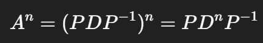

# 행렬 연산(Matrix Operations)
- 행렬은 `숫자를 다차원으로 다루는 도구`
- 벡터를 모아놓은 사각형 숫자판

<br>

## 1-1. 행렬 덧셈 / 뺄셈
- 같은 크기(같은 행X열)일 때만 가능
- 각각 원소끼리 연산

```python
A = [[1, 2],
     [3, 4]]

B = [[5, 6],
     [7, 8]]

A + B = [[1+5, 2+6],      => [[6, 8],
         [3+7, 4+8]]          [10, 12]]
```

<br>

## 1-2. 스칼라 곱 (Scalar multiplication)
- 행렬 모든 원소에 어떤 수(스칼라)를 곱해 연산

```python
3 * A = [[3, 6],
         [9, 12]]
```

<br>

## 1-3. 행렬 곱 (Matrix Multiplication)
- A(2x3) * B(3x2) 연산 가능 -> 결과는 2x2
- 비유하자면, A = 사람들의 취향 벡터, B = 콘텐츠의 속성 벡터 -> A * B = 사람이 콘텐츠를 얼마나 좋아할지 예측한 점수

<br>

# 연립방정식의 해 조건 (Solutions to Linear System)
- 연립방정식의 기본 행렬 표현 : `Ax = b`
    - A : 계수행렬(coefficient matrix)
    - x : 미지수 벡터(unknown vector)
    - b : 상수 벡터(constant vector)

- 중요한 질문 : "이 식의 해가 존재 하는가?" "있다면 몇 개인가? 유일한가? 무한개인가?"

<br>

## 해의 존재 조건
- 연립방정식 Ax = b 의 해가 존재하기 위한 조건
    - A가 선형 변환을 의미하며, 벡터 x를 입력하면 b로 바꿈. 즉, 벡터 b가 행렬 A가 표현 가능한 범위 안에 있어야 함.
    - A의 행공간(Row space)안에 b 벡터가 있어야함. 즉, **rank(A) = rank([A|b])**

    - `A|b` : 첨가행렬(Augmented matrix), A행렬에 b벡터를 오른쪽에 붙인 것

    ```python
    A = [[1, 2],
        [3, 4]]
    
    b = [5, 
        6]

    [A|b] = [[1, 2, 5],
            [3, 4, 6]]
    ```

    - `rank` : 구분되는 열의 개수

    - `rank 계산법` : 보통 행렬을 가우스 소거법(Gaussian Elimination)을 이용해 '행 사다리꼴(row echelon form)'로 만든 다음 **0이 아닌 열(행)의 개수**를 세서 계산

    ```python
    # 해가 존재 하는 경우

    A = [[1, 2],
        [3, 4]]  # rank(A) = 2
    
    b = [5, 
        6]

    [A|b] = [[1, 2, 5],
            [3, 4, 6]]

    # Row2 = Row2 - 3*Row1
    [A|b] = [[1, 2, 5],
            [0, -2, -9]] # rank([A|b]) = 2
    ```

    ```python
    # 해가 존재 하지 않는 경우

    A = [[1, 2],
        [2, 4]]  # rank(A) = 1
    
    b = [5, 
        9]

    [A|b] = [[1, 2, 5],
            [2, 4, 9]]

    # Row2 = Row2 - 2*Row1
    [A|b] = [[1, 2, 5],
            [0, 0, -1]] # rank([A|b]) = 2
    ```

    ```python
    # 해가 무한히 많은 경우

    A = [[1, 2, 1],
        [2, 4, 2]]  # rank(A) = 1
    
    b = [3, 
        6]

    [A|b] = [[1, 2, 1, 3],
            [2, 4, 2, 6]]

    # Row2 = Row2 - 2*Row1
    [A|b] = [[1, 2, 1, 3],
            [0, 0, 0, 0]] # rank([A|b]) = 1 < n
    
    # 변수 3개 중 자유변수 2개 => 무수히 많음
    ```

    ---

    ### 정사각행렬 해의 존재 조건의 구분하기
    - 정사각행렬 : A∈R^(n×n). 변수 개수 = 식의 개수
    - det(A) 계산
        - **det(A) != 0 : 가역행렬**로 판단 
        - **det(A) = 0 : 특이행렬**로 판단

    1. A가 `가역행렬(Invertible matrix)`일 때 : rank(A) = rank(A|b = n 항상 성립. **유일해 x = A^(-1)b 존재**
    2. A가 `특이행렬(Singular matrix)`일 때 : 무조건 **rank 구해**봐야 앎.

<br>

# 행렬의 대각화(Diagonalization)

- `대각화` : 행렬 A를 A=PDP^(-1)로 쓸 수 있을 때.
    - D : 대각행렬(diagonal matrix)
    - P : 고유벡터(eigenvectors)로 이루어진 행렬
- 대각화가 가능하려면:
    - 고유값(eigenvalue)를 계산해서,
    - 각각에 대응하는 선형독립 고유벡터(eigenvector)가 존재하고,
    - 결국 **고유벡터가 n개(정방행렬 A가 nxn일 때)**면 대각화 가능

    ```python
    A = [[4, 1],
        [2, 3]]
    
    # 1. 고유값(λ) 찾기 : det(A−λI)=0
    A = [[4 - λ, 1],
        [2, 3 - λ]]  # (4−λ)(3−λ)−2=0 -> λ=2,5
    

    # 2. 고유벡터 확인 : (A−λI)x=0 의 해

    # 2-1-1. λ=2일 때 A - 2I
    A - 2I = [[4 - 2, 1],
            [2, 3 - 2]]

    A - 2I = [[2, 1],
            [2, 1]]
    # 2-1-2. (A−2I)x = 0 의 해
    2x1 + x2 = 0
    2x1 + x2 = 0
    x2 = t

    x1 = (-1/2)x2 = (-1/2)t
    v1 = [(-1/2)t , t] = t[(-1/2), 1]
    v1 = [-1, 2]  # t = 2로 놓아 정수 벡터 표현

    # 2-2-1. λ=5일 때 A - 5I
    A - 5I = [[4 - 5, 1],
            [2, 3 - 5]]
    
    A - 5I = [[-1, 1],
            [2, -2]]

    # 2-2-2. (A−5I)x = 0 의 해
    -x1 + x2 = 0
    2x1 - 2x2 = 0
    x2 = x1 = t
    
    v2 = [t, t] = t[1, 1]
    v2 = [1, 1]

    #------정리-------
    A = [[4, 1],
        [2, 3]]
    
    P = [[-1, 1],
        [2, 1]]  # v1, v2

    D = [[2, 0],
        [0, 5]]  # λ1, λ2
    ```

    - 그래서 위의 예시가 대각화가 가능한가?
        - λ = 2 : [-1, 2]
        - λ = 5 : [1, 1]
        - 두 벡터는 **선형독립(linearly independent)** => 가능

---

### 대각화 불가능 예시
- **중복 고유값(λ의 완전제곱식)이 존재**하고 
- 해당 고유값의 **고유공간의 차원이 부족**한 경우
```python
A = [[1, 1],
    [0, 1]]  
    
A = [[1 - λ, 1],
    [0, 1 - λ]]  # (1-λ)^2 = 0, λ=1 (중복도 2)

A - 1I = [[0, 1],
        [0, 0]]

x2 = 0
x1 = free_variable
v = [t, 0] = eigenspace = span([1, 0])  # 선형독립 고유벡터 1개

# 고유벡터 1개 < 행렬 크기 2개 
```

<br>

# 왜 대각화를 사용할까?
- `A = PDP^(-1)`
- 위의 대각화식은 행렬 A를 새로운 축(P로 정렬된 축)에서 단순한 형태(D)로 바꾼 식
- 즉, 원래 대각선이 아닌 수들로 가득 찬 복잡한 행렬을 **단순한 대각선 값으로 압축**시킨 것

1. 행렬의 거듭듭제곱 계산이 쉬워진다.
    - 
    - 그냥 대각 원소를 각각 n제곱하면 된다.

2. 복잡한 선형변환을 간단한 축 이동으로 바꾼다.
    - 데이터의 기저(base)를 바꿔 새로운 축으로 해석하게 해줌.
    - 마치 지구 좌표계를 기울여 달리는 기차 위 자표계로 바꾸는 느낌

3. 행렬의 본질적인 성질(ex_고유값)만 남겨 단순화
    - 고유값 : 행렬의 크기 변환 정보
    - 고유벡터 : 방향 정보
    - 이 두 가지로 행렬의 핵심 작동 원리만 뽑아 정리 가능

<br>

## PCA(주성분 분석)에서 왜 대각화가 중요한가?
- `PCA` : 고차원 데이터에서 가장 중요한 축(방향)을 찾아 그 축 기준으로 데이터를 축소(차원 축소)하는 기법
    - STEP1. 공분산 행렬 계산 : C = (1/n)X^TX
        - 데이터가 많이 퍼져있는가를 측정(분산 정보)
    - STEP2. 공분산 행렬 대각화 : C = PDP^(-1)
        - D : 얼마나 정보가 많은지(각 축의 분산 크기)
        - P : 데이터의 주성분(축의 방향)

- 결국 PCA에서는 공분산 행렬 C의 고유값 분해로 **가장 큰 고유값의 고유벡터 방향으로 데이터를 정렬**
- 상위 몇 개의 주성분만 남기고 나머지는 버려서 고차원 > 저차원 (정보 손실 최소화)

```python
import numpy as np
from sklearn.decomposition import PCA
import matplotlib.pyplot as plt

# 데이터 생성
np.random.seed(1)
X = np.random.multivariate_normal([0, 0], [[3, 2.5], [2.5, 3]], 500)

# PCA 적용
pca = PCA(n_components=2)
X_pca = pca.fit_transform(X)

print("고유값 (분산 크기):", pca.explained_variance_)
print("고유벡터 (주성분):", pca.components_)
```